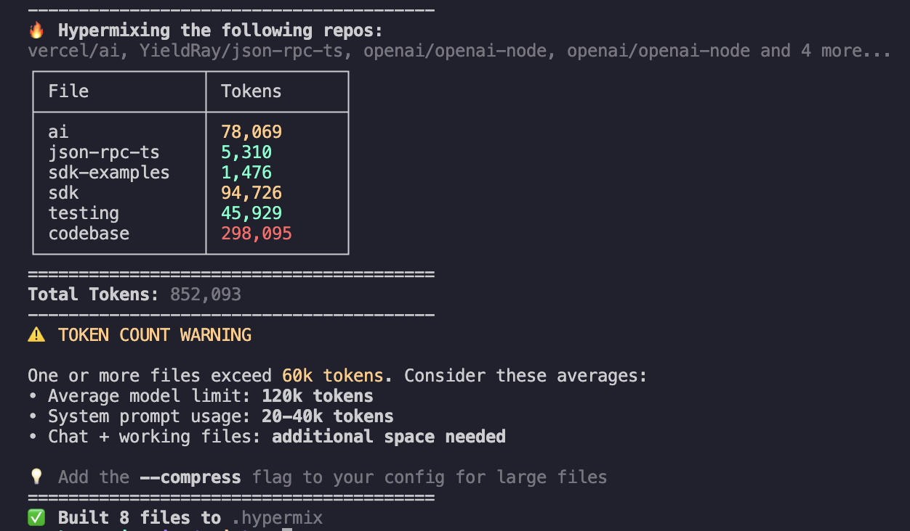

# Hypermix

<div align="center">
  

<div align="center">
    <b>Real-time, token-aware, auto-repomixing of your codebase and all of its dependencies. Manage multiple local and remote sources of context.  Native-integrations for Cursor, Claude, and Windsurf to provide optimized context for your agent. Built for Node, Bun, and Deno projects in Typescript and Javascript.</b>
  </div></br>
  <p>
    <a href="https://www.npmjs.com/package/hypermix"></a>
    <a href="https://jsr.io/@zackiles/hypermix">
    </a>
    <a href="https://github.com/zackiles/hypermix/actions/workflows/release.yml">
      
    </a>
  </p>
</div>

## Overview

Hypermix bridges the gap between repomix, your project, and your agentic development environment. It tracks token usage across your mixes, intelligently tuning your settings and agent instructions in real-time. Hypermix adds ergonomics to your workflows.

### How It Works

Once installed into a project, the Hypermix CLI is provided as a tool to your agent, prompting it to properly use and manage your mixes. It accomplishes this through it's own set of dynamic Cursor/Windsurf/Claude Code rules it injects, integrating seamlessly. Agents get access to what they need, when they need it.

To manage its lifecycle, custom npm scripts, deno or vscode tasks, and git-hooks provide are added for Hypermix to automatically maintain the most optimal context to your agent without you lifting a finger.

> [!TIP]
> Check out some examples of [When To Use It](#when-to-use-it).

## Quick Start

The easiest way to use Hypermix is with `npx` - no global installation required:

```bash
npx hypermix init
```

This single command will:

- ✓ Initialize a hypermix config file
- ✓ Add hypermix tasks in: package.json deno.json, tasks.json
- ✓ Adds agent rules and settings

### Screenshot



### Other Installation Methods

Hypermix can be used as a CLI or accessed programmatically by installing it from NPM (Node, Bun) or JSR (Deno).

#### Deno

```bash
deno add -g jsr:@zackiles/hypermix
```

#### Node / Bun

```bash
npm install -g hypermix
```

## Usage

In general, a design goal of Hypermix is not having to access it at all once you've installed it. However, if you'd rather manage the lifecycle of your mixes yourself, or access Hypermix programmatically you can. All options and configuration have intelligent safe defaults.

### Generating Mixes

```bash
# Run with a custom config file
npx hypermix --config hypermix.config.ts

# Run with custom output directory
npx hypermix --output-path ./custom-context
```

**Available flags:**

```
--config, -c       Path to hypermix config file (defaults to hypermix.config.{js,ts,json,jsonc})
                   Example: npx hypermix --config ./custom-config.ts
--output-path, -o  Override the default output directory for all context files
                   Example: npx hypermix --output-path ./custom/path
--silent, -s       Suppress all output except errors
```

The script also passes through flags to the underlying repomix tool, which all can be configured in the Hypermix config file.

### Project Integration

When you run hypermix for the first time, it automatically:

1. **Adds hypermix scripts to your project:**
   - For npm/yarn projects: Updates `package.json` with a `hypermix` script
   - For Deno projects: Updates `deno.json` with a `hypermix` task
   - For Makefile projects: Adds a `hypermix` target

2. **Configures ignore files:**
   - Updates `.gitignore` to exclude generated context files
   - Updates `.cursorignore` to allow AI tools to access context files
   - Creates `.cursorignoreindex` to prevent automatic indexing
3. **Configures agent rules:**
   - Detects Claude Code, Cursor, and Windsurf projects and configures rules and settings that allow agents to optimize the mixes they're provided

**After initial setup, use from your project task runner as needed:**

```bash
npm run hypermix
deno task hypermix
bun run hypermix
```

> [!IMPORTANT]
> Certain settings in files such as .gitignore, .cursorignore, .cursorignore files are added or modified to optimize how the mixes are used. None of them are required and can be removed at any time.

### Token Awareness

Hypermix tracks token usage across all context files. When you run the CLI it will output a handful of details:

- Reports token counts per file and total usage
- Warns when files exceed recommended token limits
- Optimizes context files to stay within model token windows
- Provides streaming token counting for large files

## Configuring Hypermix

Hypermix builds context by processing a `mixes` array, which can be defined in:

- `hypermix.config.js`
- `hypermix.config.ts`
- `hypermix.config.json`
- `hypermix.config.jsonc`

If no config file is found, hypermix will use default settings to process your current directory.

Each object in the mixes array defines a single context-building task. There are two main ways to configure a mix item, which are mutually exclusive:

### 1. Add Remote Repos

This type of mix fetches code from a specified remote GitHub repository:

- **`remote`**:
  - **Type**: `string`
  - **Required**: Yes
  - **Description**: The GitHub repository URL in `owner/repo` format (e.g.,
    `denoland/std`).

- **`include`**:
  - **Type**: `string[]`
  - **Required**: No
  - **Description**: An array of glob patterns for files/directories to include
    (e.g., `['src/**/*.ts', 'README.md']`). Defaults to `**/*` (all files).

- **`ignore`**:
  - **Type**: `string[]`
  - **Required**: No
  - **Description**: An array of glob patterns to exclude files/directories
    (e.g., `['**/test_data/**']`).

- **`output`**:
  - **Type**: `string`
  - **Required**: No
  - **Description**: Custom output path for the generated XML file, relative to
    the global `outputPath`. If omitted, a path is derived from the remote URL
    (e.g., `owner/repo.xml`).

- **`extraFlags`**:
  - **Type**: `string[]`
  - **Required**: No
  - **Description**: An array of additional boolean command-line flags to pass
    to `repomix` (e.g., `['--compress']`).

### 2. Add Your Codebase

This type of mix is for specifying your local codebase by pointing to its existing `repomix.config.json`:

- **`config`** or **`repomixConfig`**:
  - **Type**: `string`
  - **Required**: Yes
  - **Description**: Path to your `repomix.config.json` file (e.g.,
    `'./repomix.config.json'`).

- **`extraFlags`**:
  - **Type**: `string[]`
  - **Required**: No
  - **Description**: An array of additional boolean command-line flags to pass
    to `repomix` (e.g., `['--quiet']`). Other options like `include`, `ignore`,
    and `output` are typically defined within the referenced
    `repomix.config.json` itself.

### Example `hypermix.config.ts`

Here's how you might structure your `hypermix.config.ts` to include multiple
mixes:

```typescript
// hypermix.config.ts
import { join } from '@std/path' // Or your preferred path joining utility

export default {
  silent: false, // Global option: suppress non-error output
  outputPath: '.hypermix', // Global option: root directory for all generated .xml files
  mixes: [
    // Example of a remote repository mix
    {
      remote: 'denoland/std',
      include: ['fs/**/*.ts'], // Only include files from the fs module
      ignore: ['fs/**/_*.ts', 'fs/**/test*.ts'], // Exclude private and test files
      output: join('@std', 'fs.xml'), // Custom output path
      extraFlags: ['--compress'], // Compress this specific output
    },
    // Another remote mix, simpler configuration
    {
      remote: 'vercel/ai',
      include: ['packages/ai/core/**/*.ts'],
      output: 'vercel-ai-core.xml',
    },
    // Example of a local mix using an existing repomix.config.json
    {
      repomixConfig: './repomix.config.json', // Use local repomix config for the current project
      extraFlags: ['--quiet'], // Pass --quiet to repomix for this local build
    },
    // You can add more remote or local mixes as needed
  ],
}
```

This structure allows for flexible and powerful context aggregation from various
sources into a centralized location, tailored to your project's needs.

## When To Use It

- Enhance AI agent context with comprehensive codebase knowledge
- Optimize token usage across large projects
- Integrate multiple repositories into a unified context
- Provide better context to AI-powered development tools
- Simplify AI integration in complex projects
- Manage context files with intelligent repository mixing

## License

MIT License - see the [LICENSE](LICENSE) file for details.
